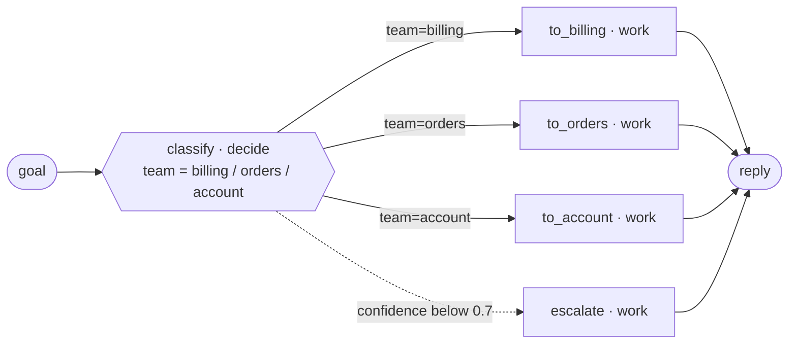
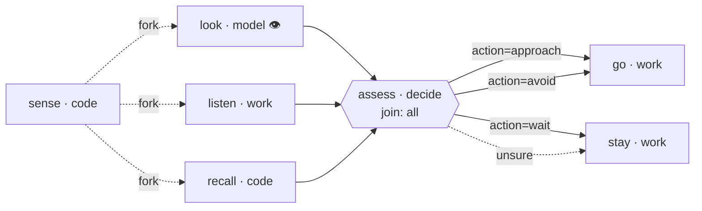
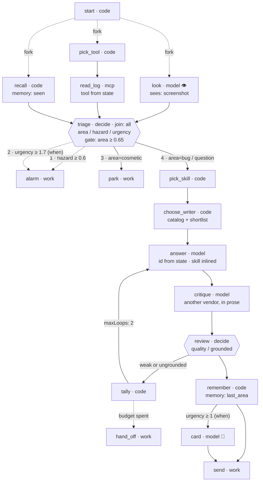

<p align="center">
  
</p>

<p align="center">
  <a href="https://www.npmjs.com/package/@ghostmind-dev/ensemble"></a>
  
  
  
</p>

---

## The goal

**To build systems that decide for themselves, run for days, and can tell you afterwards exactly what they knew and how sure they were.**

Not a smarter agent — a structure around one. A graph of steps, a shared state
every step reads and writes, a calibrated judgement at each fork, and a record of
all of it as JSON.

Agents with tools are winning on open-ended work, and nothing is watching them.
`ensemble` is what watches: it makes the decisions that steer the work, carries
the memory between runs, caps the spending, and writes down every answer with its
own confidence. The work itself stays yours — any library, any SDK, any agent,
inside a handler you wrote.

```ts
const { result, run } = await triage({ goal: "I was charged twice for A-104" });

run.steps[0].answers.team
// → { type: "choice", value: "billing", confidence: 0.91,
//     probabilities: { billing: 0.91, orders: 0.06, account: 0.03 } }
```

That second line is the product. Not *the model said billing* — **billing at
p=0.91, here is the whole distribution, and here is what it cost.**

---

## The idea in one picture

<p align="center">
  
</p>

Four kinds of work, and four different things that should do them:

| Kind of work | Who does it | Why |
|---|---|---|
| **Meaning** — which category, is this X, how good is it | [Jev](https://docs.typesafe.ai), through a `decide` node | Calibrated, ~100 ms, ~$0.00002. Every option declared before anything runs |
| **Arithmetic** — counts, thresholds, dates, prices | a `code` node or a `when:` edge | Classifiers are documented to be unreliable at counting and date ordering |
| **Perception** — looking at an image, writing, drawing | a `model` node, or any SDK in your handler | Jev takes text and cannot see |
| **Effects** — send, store, charge, page a person | a `work` handler | Your code, any library. That seam is the point |

Everything else follows from the first row. A classifier answers in **three
closed shapes** — yes/no, one-of-N, a rubric position — so every branch of every
decision is known *before the run*. That single fact buys a complete graph you
can draw, a validator that proves nothing falls through, and a record worth
auditing.

> With a generative router you cannot enumerate the branches. With a classifier
> you can.

---

## Install

```sh
npm install @ghostmind-dev/ensemble
export TYPESAFE_API_KEY=...       # https://console.typesafe.ai/settings/keys
export OPENROUTER_API_KEY=...     # https://openrouter.ai/keys — only for model nodes
```

Node 22.18+. Runner files are `.mts`, loaded by Node's own type stripping, so
there is no build step. Zero runtime dependencies.

It is a **library**, not a global tool. Put the dev commands in `package.json`
and they stay pinned to the project:

```json
"scripts": {
  "validate":  "ensemble validate",
  "graph":     "ensemble graph",
  "check":     "ensemble check",
  "calibrate": "ensemble calibrate",
  "start":     "node run.mts"
}
```

---

# Demo 1 · Route a message, and know when not to

The smallest thing that is still the whole idea: one question, every option
wired, and an exit for when the classifier is unsure.



```ts
import { runner, choice } from "@ghostmind-dev/ensemble";

export default runner({
  name: "triage",

  work: {                                     // ← your code. Anything at all.
    billing: ({ goal }) => myQueue.push("billing", goal),
    orders:  ({ goal }) => myAgent.run("order-lookup", goal),   // an agent, if you like
    account: ({ goal }) => myCrm.open(goal),
    human:   ({ goal }) => pageSomeone(goal),
  },

  nodes: {
    classify: {
      decide: {
        team: choice("Which team should handle this?", {
          billing: { what: "Charges, invoices, refunds", not_for: "Where a parcel is" },
          orders:  { what: "Delivery, cancellation, returns", not_for: "Money questions" },
          account: { what: "Login, address, personal data", not_for: "Anything about an order" },
        }),
      },
      reads: ["goal"],                                  // the ONLY state Jev sees
      gate: { on: "team", min: 0.7, to: "escalate" },   // unsure? a person reads it
    },
    to_billing: { work: "billing", writes: ["reply"] },
    to_orders:  { work: "orders",  writes: ["reply"] },
    to_account: { work: "account", writes: ["reply"] },
    escalate:   { work: "human",   writes: ["reply"] },
  },

  edges: [
    { from: "classify", to: "to_billing", on: "team=billing" },
    { from: "classify", to: "to_orders",  on: "team=orders" },
    { from: "classify", to: "to_account", on: "team=account" },
  ],

  entry: "classify",
  result: "reply",
});
```

**Delete one edge and the graph refuses to run:**

```
node "classify" asks "team" but nothing handles "account" — the run would fall
through to the exit on that answer. Wire it, or add a default edge from
"classify" with no on/when.
```

That check is free, offline, and it is the reason the closed answer space was
worth having.

```sh
npm run validate -- triage.mts          # ✓ triage is sound
npm run graph    -- triage.mts | jq .edges
```

---

# Demo 2 · Look, listen and remember — at the same time

A perception tick. Three lanes run concurrently, meet at one decision, and the
system remembers something across ticks.



```ts
runner({
  name: "senses",
  inputs: ["goal", "frame", "sensors"],
  memory: ["seen"],                           // ← survives the tick

  nodes: {
    sense: { code: () => Date.now(), writes: ["at"] },

    look: {                                   // lane 1 — the only node touching pixels
      model: "google/gemini-2.5-flash",
      prompt: (s) => `What is in front of the robot? Its task: ${s.goal}`,
      sees: ["frame"],
      writes: ["scene"],
    },
    listen: { work: "sensors", reads: ["sensors"], writes: ["heard"] },    // lane 2
    recall: { code: (s) => Number(s.seen ?? 0) + 1,                        // lane 3
              reads: ["seen"], writes: ["seen"] },

    assess: {
      join: "all",                            // ← runs once, after every lane arrives
      decide: {
        action: choice("What should the robot do now?", { approach: …, avoid: …, wait: … }),
        novel:  noul("Is this different from what a robot on this task usually sees?"),
      },
      reads: ["goal", "scene", "heard"],      // the senses' WORDS, never the frame
      gate: { on: "action", min: 0.7, to: "stay" },
    },
  },

  edges: [
    { from: "sense", to: "look",   fork: true },
    { from: "sense", to: "listen", fork: true },
    { from: "sense", to: "recall", fork: true },
    { from: "look", to: "assess" }, { from: "listen", to: "assess" }, { from: "recall", to: "assess" },
  ],
});
```

Three things are being demonstrated, and each is checked before the run:

**Lanes cannot race.** `validate` refuses two lanes that share a node or touch
the same state key, in either direction. Write to separate keys and combine after
the join. One controller covers every lane, so a failure on one cancels the
others, and budget, timeout and cancellation apply to all.

**Jev cannot see, and that is enforced.** Send an image key to a decide node and
it refuses by name:

```
node "assess" sends "frame" to the decider, but that key holds image data and Jev
takes text only. Have a model node look at it and write down what it saw, then
decide on that.
```

Which is also the cheap architecture: **look once with a model, then ask four
narrow questions about the sentence** for a fraction of a cent.

**Memory is declared.** `memory: ["seen"]` means the key arrives like an input, a
node in the graph writes it, and `graph.json` says what this system remembers.
Nothing else is remembered — and that is visible too.

---

# Demo 3 · Everything at once

The demos above isolate one idea each. This is what a graph looks like by its
third week — **every concept in the library, in one file**, and every path
through it proved for $0 before a token is spent.

A support front desk: look at the screenshot, read the log and recall what has
been seen before — **all three at the same time** — then decide once, answer
with a skill inlined, have a second model critique it, score that critique, loop
while it is weak, illustrate only if it matters, and deliver.



**Every concept, and where it is:**

| Concept | In this graph |
|---|---|
| all five node kinds | `decide` (triage, review) · `work` (alarm, park, hand_off, send) · `code` (start, pick_tool, recall, pick_skill, choose_writer, tally, remember) · `model` (look, answer, critique, card) · `mcp` (read_log) |
| all three questions, one call | `area` choice · `hazard` noul · `urgency` score — asked together at `triage` |
| a confidence gate | `gate: { on: "area", min: 0.65, to: "hand_off" }` |
| safety that outranks the gate | the `hazard>=0.6` edge is **declared first**, so it is tried first |
| fork / join | three lanes from `start`, meeting at `join: "all"` on `triage` |
| a model that looks | `look` with `sees: ["screenshot"]` — and `triage` reads `scene`, never the image |
| a model that draws | `card`, writing `["caption", "image"]` positionally |
| a model chosen at run time | `answer` with `model: { from: "writer" }`, resolved by `choose_writer` |
| a skill, inlined | `pick_skill` returns a name (or `"none"`); `answer` takes `skills: { from: "skill" }` |
| one MCP tool call | `read_log`, with `tool: { from: "tool" }` — the graph still says what it can reach |
| memory across ticks | `memory: ["seen", "last_area"]`, written by `recall` and `remember` |
| a loop with a budget | `{ from: "tally", to: "answer", maxLoops: 2 }`, then `tally → hand_off` |
| both branch forms | `on: "area=bug"` (the node that asked) · `when: (s) => Number(s.urgency) >= 1.7` (arithmetic) |

The edges are the control flow, and **order is part of it** — first match wins:

```ts
edges: [
  { from: "start", to: "look",      fork: true },   // three lanes, all forks or none
  { from: "start", to: "pick_tool", fork: true },
  { from: "start", to: "recall",    fork: true },
  { from: "pick_tool", to: "read_log" },
  { from: "look", to: "triage" }, { from: "read_log", to: "triage" }, { from: "recall", to: "triage" },

  // Safety outranks the gate and the routing, because it is declared first.
  { from: "triage", to: "alarm", on: "hazard>=0.6" },
  { from: "triage", to: "alarm", when: (s) => Number(s.urgency) >= 1.7 },
  { from: "triage", to: "park",       on: "area=cosmetic" },
  { from: "triage", to: "pick_skill", on: "area=bug" },
  { from: "triage", to: "pick_skill", on: "area=question" },
  …
  { from: "review", to: "tally", when: (s) => {
      const quality = Number(s.quality), grounded = Number(s.grounded);
      return quality < 1.5 || grounded < 0.5;       // read both BEFORE combining
  } },
  { from: "review", to: "remember" },
  { from: "tally", to: "answer", maxLoops: 2 },     // the loop, and its budget
  { from: "tally", to: "hand_off" },                // spent: a person takes it
  { from: "remember", to: "card", when: (s) => Number(s.urgency) >= 1 },
  { from: "remember", to: "send" },
  { from: "card", to: "send" },
]
```

**Proving thirteen paths for $0.** The dry run stubs Jev, OpenRouter and MCP,
runs *your* handlers for real, and goes once per declared answer:

```
✓ default              start → look → pick_tool → recall → read_log → triage → pick_skill → choose_writer →
                       answer → critique → review → tally → answer → critique → review → tally →
                       answer → critique → review → tally → hand_off
✓ triage.hazard=0.9    start → look → pick_tool → recall → read_log → triage → alarm
✓ triage.area=cosmetic start → look → pick_tool → recall → read_log → triage → park
✓ triage gate tripped  start → look → pick_tool → recall → read_log → triage → hand_off
  edges never taken: e17 (review→remember), e20 (remember→card), e21 (remember→send), e22 (card→send)
✓ frontdesk: 13/13 dry runs completed · $0
```

Read the first line: three lanes ran, the writer ran three times — one pass plus
a budget of two — and then a person got it. And the report is honest about what
it did **not** reach: the tail needs a *good, grounded* draft, which `--explore`
never produces because it varies one answer at a time. Force it and those edges
are proven live:

```sh
… --answer review.quality=2 --answer review.grounded=0.9                  # → remember → card → send
… --answer review.quality=2 --answer review.grounded=0.9 --answer triage.urgency=0   # → remember → send
```

That is the whole development loop: **the graph tells you which branches you have
never tested, and testing them costs nothing.**

Full source: [`examples/09-frontdesk/frontdesk.mts`](examples/09-frontdesk/frontdesk.mts).
A smaller version of the same shape, without the parallel lanes and MCP, is
[`examples/08-studio`](examples/08-studio/studio.mts).

---

## Short runs and long runs

Everything above is **one function call**. The frontdesk graph is three lanes in
parallel, one ~100 ms decision, and a model or two: seconds to a couple of
minutes, inside your request handler, your queue worker or your cron job.

```ts
const { result, run } = await frontdesk({ goal, screenshot, log_path });
```

At that scale the useful parts are the ones that cost nothing: `validate` before
you deploy, `budget` and `stepTimeout` so one bad call cannot hang a request,
and `run.json` so the answer can be explained afterwards.

`supervise` is what you add **when the tick should repeat** — not something the
tick needs in order to exist. Same graph, same guarantees; it just gains memory
between runs, budgets across runs, a journal and a watcher. A two-minute run and
a two-day loop are the same code, and you only pay for the second when you want
it.

---

# Demo 4 · Run for days, and notice when it drifts

<p align="center">
  
</p>

A runner is **one tick**. `supervise()` keeps one alive: memory between ticks,
budgets that stop or rest, a journal a restart resumes from, and a watcher that
judges whether the whole thing is still going anywhere.

```ts
import { supervise } from "@ghostmind-dev/ensemble";

await supervise(worker, {
  next: async () => ({ goal: await inbox.next() }),   // the sense organ; undefined ends it
  memory: { topics: "" },                             // starting values for the declared keys
  budget: { total: 20, perDay: 5, perRun: 0.05 },     // perDay RESTS, it does not die
  run: { stepTimeout: 120_000 },                      // a hung handler fails, not the loop
  watch: { every: 10, runner: watcher },              // the conscience, below
  journal: ".ensemble/live",                          // crash-safe; a restart resumes here
  onAlert: ({ reason }) => pager.send(reason),        // your effect
});
```

Long-running systems rarely fail by crashing. They fail by **drifting**: stuck on
one path, unsure more and more often, repeating themselves, quietly spending. So
the supervisor computes vitals — failure rate, gate rate, sameness, spend per
tick — and hands them to a **watcher, which is just another runner**:

```ts
const watcher = runner({
  name: "watcher",
  inputs: ["goal", "vitals", "recent"],

  nodes: {
    vitals: { code: () => null },             // somewhere for the arithmetic edges to leave
    judge: {
      decide: {
        progress: noul("Do the recent ticks show the work moving toward the goal?"),
        looping:  noul("Do the ticks keep producing the same result while nothing changes?"),
      },
      reads: ["goal", "recent"],              // the story as text; the numbers stay out
    },
    carry_on: { code: () => "continue" },
    flag:     { code: () => "alert" },
    halt:     { code: () => "stop" },
  },

  edges: [
    // numbers first, in code — and free. Jev is never asked to compare them.
    { from: "vitals", to: "halt", when: (s) => Number((s.vitals as Vitals)?.failureRate) >= 0.5 },
    { from: "vitals", to: "judge" },
    { from: "judge", to: "flag", on: "looping>=0.7" },
    { from: "judge", to: "carry_on", on: "progress>=0.5" },
    { from: "judge", to: "flag" },
  ],
  entry: "vitals",
});
```

At **$0.00002 a question**, a system can afford to ask whether it is still on
track every few ticks, forever. That is the niche: not a smarter agent, a cheap
calibrated conscience around whatever does the work.

**The watched work does not author the evidence.** `recent` carries facts the
supervisor wrote — tick, status, path, timing. A tick that handles a support
message or a web page would otherwise be writing the text its own supervisor
reads. Opt in with `watch: { evidence: "facts+text" }` only where the output is
trusted.

What the loop leaves behind:

```
.ensemble/live/
  journal.jsonl     every step as it finished, every run, every alert, every verdict
  checkpoint.json   tick, spend, memory, the recent window — replaced atomically
  pulse.json        rewritten on every node event: if it goes stale, the process is stuck
  lock              the pid of the one supervisor allowed on this journal
```

---

## Does it actually work? Calibrate it

`validate` proves the wiring and a dry run proves the plumbing. Neither says
whether a decision is *right*. `calibrate` does — it asks each decide node in
isolation, no handlers, no models, about $0.00002 a case:

```jsonl
{"inputs":{"goal":"I was charged twice"},"expect":{"team":"billing"}}
{"inputs":{"goal":"where is my parcel"},"expect":{"team":"orders"}}
{"inputs":{"goal":"refund please"},"expect":{"team":"billing"},"set":"holdout"}
```

```sh
npm run calibrate -- triage.mts cases.jsonl --holdout held.jsonl --budget 0.05
```

```
  classify.team  choice · n=120 · right 91.7% · confidence 0.88 · gap 0.031
    gate min 0.7 → keeps 93.3%, 96.4% of those right
    gate min 0.8 → keeps 85.0%, 98.0% of those right

  classify.team  dev 91.7% → holdout 89.2% (-2.5%)
```

Three numbers worth knowing:

- **accuracy** — how often it is right.
- **gap** — the distance between how sure it was and how often it was right. Near
  zero means a confidence gate can be trusted. Confidently wrong is the one
  failure no gate can save you from.
- **dev → holdout** — tune the wording against `dev`, freeze, then read `holdout`
  once. A drop of 0.1 or more means the questions were fitted to the examples
  rather than to the job.

The gate table is how you pick `gate.min`: it prices every threshold in what it
keeps and what it gets right.

---

## The three questions

Jev answers in exactly three shapes and refuses everything else. That is the
feature.

| Builder | Answer space | Lands on state as | Also returns |
|---|---|---|---|
| `choice(instructions, options)` | one of N, max 255 | the option name | `probabilities`, `confidence` |
| `score(instructions, levels)` | a 2–10 level rubric | a **fractional** number | `probabilities`, `confidence`, `legend` |
| `noul(instructions, criteria?)` | yes / no | P(yes), 0–1 | — the number *is* the certainty |

A score is the expected value across levels, not the winner: `1.3` means mostly
level 1 with some level 2. That is what makes it useful in a threshold.

**Ask several at once.** Questions in one node go out in a single request and are
answered independently — one answer never becomes hidden context for another. A
speculative extra question is nearly free, so ask it and let your code decide
whether it mattered.

**Describe the boundary, not just the option.** `not_for` says what belongs in
the *neighbouring* option, which is exactly where classifiers fail.

```ts
choice("What kind of picture?", {
  photo:   { what: "Photoreal image of a scene", not_for: "Explanatory figures" },
  diagram: { what: "Boxes, arrows, labels",      not_for: "Photoreal scenes" },
})
```

---

## The five node kinds

A node is exactly one of these, told apart by which key it has. There is no
`runtime:` string.

```ts
// decide — one Jev call. The only thing this library does itself.
classify: { decide: { team: choice(…), urgent: noul(…) },
            reads: ["goal", "customer_plan"],          // the ONLY state sent. Required.
            gate: { on: "team", min: 0.7, to: "escalate" } }

// work — one of YOUR handlers, by name. Any library, any SDK, any agent.
send: { work: "billing", reads: ["goal"], writes: ["reply"] }

// code — deterministic, free, instant. Where arithmetic belongs.
tally: { code: (s) => Number(s.rounds ?? 0) + 1, writes: ["rounds"] }

// model — one generative call, through OpenRouter. Write, draw, or LOOK.
look: { model: "google/gemini-2.5-flash", prompt: (s) => `…${s.goal}`,
        sees: ["frame"], skills: { from: "skill" }, writes: ["scene"] }

// mcp — ONE tool call. Not a loop.
read: { mcp: { server: "fs", tool: "read_text_file" },
        args: (s) => ({ path: s.path }), writes: ["file_text"] }
```

`reads` on a decide node is **required and load-bearing**: accuracy is documented
to fall as irrelevant detail grows, so the filter is the feature.

`writes` decides what lands on the blackboard: **one key takes the return value
whole**, several destructure it, none means the node only had an effect. Watch
that first rule — returning `{ rounds: 1 }` for `writes: ["rounds"]` nests it as
`rounds.rounds`.

### Your handlers

```ts
work: {
  photo: async ({ goal, state, signal, report }) => {
    report({ cost: 0.021, meta: { provider: "gemini", model: "nano-banana-pro" } });
    return await myImageApi(goal, { signal });
  },
}
```

`report()` keeps the run record honest about money the runner did not spend.
`signal` aborts on budget, timeout or cancellation — pass it to your fetch.

**Nothing is off limits in here.** A handler is ordinary TypeScript: a vendor
SDK, an agent framework running its own loop, a database client, a scraper. The
zero-dependency rule binds *this package*, not what you build with it. The graph
shows one opaque step, and the decisions around it stay calibrated and provable.

---

## Branching

```ts
edges: [
  // MEANING — a declared option. Static, enumerable, drawable, provable.
  { from: "classify", to: "gen_photo", on: "picture_kind=photo" },
  { from: "classify", to: "lettering", on: "needs_text>=0.7" },

  // ARITHMETIC — ordinary TypeScript.
  { from: "classify", to: "hand_off", when: (s) => Number(s.complexity) >= 1.8 },

  // No condition: the default. Also satisfies the exhaustiveness check.
  { from: "review", to: "ship" },
]
```

| `on:` form | Means |
|---|---|
| `"kind=photo"` | a choice answered with that option |
| `"needs_text"` / `"!needs_text"` | a noul at or above / below 0.5 |
| `"needs_text>=0.7"` | an explicit threshold — `>=`, `>`, `<=`, `<` |

A score has no `on:` form on purpose: a score is a number, so it goes in `when:`.
Edges are tried in declaration order, first match wins, and `maxLoops` on an edge
is a loop budget that, once spent, lets the next edge take over.

**The confidence gate** fires before any edge: below `min` the run diverts to
`to`, and the step records `took: "gate"`. An unsure classifier should not act.

---

## What it emits

**This library draws nothing.** It emits two JSON documents and leaves rendering
to whatever you already use. A renderer is opinionated and goes stale; a schema
is neither. Both are flat `nodes[]` / `edges[]` with stable ids — what dagre,
elk, graphviz, cytoscape and d3 already eat.

### `graph.json` — what *could* happen

```jsonc
{
  "$schema": "https://ghostmind.dev/ensemble/graph-v1.json",
  "runner": { "name": "triage", "hash": "sha256:9c92f2f1a59ff24d", "entry": "classify",
              "inputs": ["goal"], "memory": ["seen"] },
  "nodes": [
    { "id": "classify", "kind": "decide", "cost": "cheap", "reads": ["goal"], "writes": ["team"],
      "decide": { "model": "jev-latest", "questions": [ /* every option, in full */ ],
                  "gate": { "on": "team", "min": 0.7, "to": "escalate" } } },
    { "id": "assess", "kind": "decide", "join": "all" }
  ],
  "edges": [
    { "id": "e0", "from": "classify", "to": "to_billing", "on": { "question": "team", "option": "billing" } },
    { "id": "e1", "from": "sense", "to": "look", "fork": true },
    { "id": "e2", "from": "review", "to": "redo",
      "when": { "source": "(s) => Number(s[\"quality\"]) < 1.5", "reads": ["quality"] } }
  ],
  "data": [
    { "key": "goal", "producedBy": ["$input"],            "readBy": ["classify"] },
    { "key": "seen", "producedBy": ["$memory", "recall"], "readBy": ["recall"] }
  ]
}
```

- **`edges[].on`** names the question *and* the option, so a branch is labelled
  without guessing.
- **`edges[].when`** carries the predicate's own source text and the keys it
  touches. A code branch cannot be enumerated, so instead of pretending, the
  document tells the truth. Nothing is executed to produce it.
- **`nodes[].cost`** is a class, not a number: `cheap` is a Jev call, `metered`
  is your handler, `free` is plain code. Colour by it and the money is visible.

### `run.json` — what *did* happen

```jsonc
{
  "$schema": "https://ghostmind.dev/ensemble/run-v1.json",
  "run": { "id": "20260918T003102-triage", "graph": "sha256:9c92f2f1a59ff24d",
           "status": "completed", "cost": { "total": 0.0213, "currency": "USD" } },
  "steps": [
    { "n": 1, "node": "classify", "kind": "decide", "lane": "main",
      "started": "2026-09-18T00:31:02.113Z", "ended": "…", "ms": 96, "cost": 0.000021,
      "asked": { "goal": "I was charged twice for A-104" },
      "answers": { "team": { "type": "choice", "value": "billing", "confidence": 0.91,
                             "probabilities": { "billing": 0.91, "orders": 0.06, "account": 0.03 } } },
      "gate": { "on": "team", "passed": true, "min": 0.7, "measured": 0.91 },
      "took": "e0" }
  ],
  "state": { "goal": "…", "team": "billing", "reply": "…" }
}
```

**The join is one field.** `steps[].took` is an edge id from `graph.json`, and
`run.graph` is that document's hash. Highlighting the path taken is a
set-membership test; finding the hot path across fifty runs is a `groupBy`.
`asked` records what each node was *given*, which is what an audit needs — for a
decide node it is exactly what Jev saw.

---

## The CLI

Reached through `package.json` scripts, never installed globally.

```sh
npm run validate  -- <file>                 # prove the graph      — free, offline
npm run graph     -- <file> | jq            # emit graph.json      — free, offline
npm run check     -- <file>                 # can it run HERE?     — reads the live catalogue
npm run calibrate -- <file> cases.jsonl     # score its decisions  — ~$0.00002 a case
npx ensemble run  <file> "goal" --budget 0.05
```

Data goes to stdout so it can be piped; commentary goes to stderr.

### The development loop

Each step is cheap and catches a class of mistake the next one cannot:

1. **`validate`** — every option wired, every key with an origin, every lane
   disjoint. Free.
2. **dry run** — the bundled `dryrun.mts` stubs Jev, OpenRouter and MCP and runs
   *your* handlers for real, once per declared answer, then lists the edges no
   run ever took. Free.
3. **`check`** — does the model you named exist, can it see, are the keys set.
4. **`calibrate`** — are the decisions right, and where should the gate sit.
5. **`run`** — the first one that costs money.

### Let an agent build it

This repo is also a Claude Code plugin marketplace:

```sh
/plugin marketplace add ghostmind-labo/ensemble
/plugin install ensemble@ghostmind-ensemble
```

| Skill | For |
|---|---|
| `ensemble-build` | Use case → a runner that validates and has been dry-run down every branch |
| `ensemble-questions` | Writing `choice` / `score` / `noul` that Jev answers well, gates and thresholds |
| `ensemble-runs` | Reading `run.json` and supervised journals, explaining a path, calibrating |

The plugin is not part of the npm package; the library itself ships no skills.

---

## Skills and MCP, without an agent loop

**Skills** follow the [Agent Skills standard](https://agentskills.io).
`loadSkills()` reads them from `.claude/skills`, `.ensemble/skills`,
`~/.claude/skills` and installed plugins; `skillOptions()` turns them into a
`choice`. Choosing a skill *is* a classification, so a classifier should do it —
TypeSafe measured the case at 182 skills: an agent working from truncated index
entries loaded the wrong one 16.8% of the time, against 7.3% when a System One
model ranked them first. Skills are local files, so the options are knowable
offline and the graph stays complete.

**MCP** is one server, one tool, one call. Because both are named in the node,
`graph.json` says exactly what a workflow can reach *before it runs* — the thing
a tool-calling agent can never tell you. Servers start lazily and stop with the
run.

**A model node never needs tool-calling support.** The `mcp` node makes the call
itself and puts the result on the blackboard; skills are inlined as text. So a
small model, or a local one, still sits downstream of every tool and skill you
own. Capability constrains only what a model must do *itself* — vision is the
real case, and `ensemble check` catches it against the live catalogue.

---

## Jagged edges

TypeSafe [publishes Jev's known failure modes](https://docs.typesafe.ai/model-jaggedness/jev-1.13).
They are design constraints, and several are enforced here:

| Weakness | What this library does about it |
|---|---|
| Counting and arithmetic are unreliable | `when:` and `code` nodes exist. Never gate on a Jev-computed number |
| Dates are read as text, not ordered quantities | Extract with a model, compare in code |
| Accuracy falls as irrelevant state grows | `reads` is required on every decide node, and is a hard filter |
| Multi-hop questions lose accuracy | One question, one property. Ask several — they are parallel |
| State is not treated as hostile | Guard before routing on unvetted text; a watcher reads supervisor-written facts by default |
| No structural invariants | Calibrate each question on your own data; don't derive one threshold from another |
| Literal reading | `not_for` on every option. State boundaries, don't imply them |
| It does not generate | Generation is a model node or your handler, never a decision |

---

## What this deliberately does not do

No prompts of its own, no built-in agent loop, no vendor SDKs *in the package* —
your handlers may use any of them. Skills and MCP are here as choices and single
calls, never a model picking its own next tool. No server, no browser viewer, no
mermaid or markdown exporter. No variable-width fan-out (that is a handler's
job), no replay.

Those are not oversights — they were removed. Keeping them would have made this a
framework you live inside rather than a function you call, and the whole point is
that **your code owns the control flow**.

---

## Examples

```sh
npm run validate -- examples/01-triage/triage.mts
node plugin/skills/ensemble-build/scripts/dryrun.mts examples/07-senses/senses.mts "watch the door" --explore
```

| | |
|---|---|
| [`01-triage`](examples/01-triage/triage.mts) | The smallest whole idea: one choice, three branches, a gate |
| [`02-picture`](examples/02-picture/picture.mts) | Real image generation: ask the durable question, resolve today's model in code, draw |
| [`03-refine`](examples/03-refine/refine.mts) | A loop that knows when to stop — a score gate, a loop budget, counting in code |
| [`04-robot`](examples/04-robot/brain.mts) | A little brain: a vision model looks, Jev decides, your handler acts |
| [`05-assistant`](examples/05-assistant/assistant.mts) | Skills and MCP, chosen rather than looped over |
| [`06-watch`](examples/06-watch/watch.mts) | A conscience for a loop that runs for days — and it supervises `01-triage` when run directly |
| [`07-senses`](examples/07-senses/senses.mts) | Look, listen and count at once: three forked lanes, one join, a memory key |
| [`08-studio`](examples/08-studio/studio.mts) | The complex shape: four models in sequence, a budgeted loop, both branch forms, safety first |
| [`09-frontdesk`](examples/09-frontdesk/frontdesk.mts) | **Everything at once**: five node kinds, three lanes, memory, a skill, MCP, a loop, and both branch forms |

---

## API

```ts
import {
  runner,                           // define one
  choice, score, noul,              // ask
  validate, toGraph, execute,       // prove, emit, run
  calibrate,                        // score the decisions against labelled cases
  supervise,                        // run it as a loop that lives for days
  jev, openrouter, reporter,        // the decider, the caller, the terminal view
  catalog, shortlist, modelOptions, // the live model list, filtered in code
  loadSkills, skillOptions,         // Agent Skills from disk
  connect, pool, toolOptions,       // MCP
  preflight, searchServers,         // discovery
} from "@ghostmind-dev/ensemble";
```

Every seam is a function type, so anything can be replaced: `Decider` (Jev),
`Caller` (OpenRouter), `Handler` (your code). That is what makes the test suite
free and offline, and what keeps one young vendor from being a single point of
failure.

```ts
await triage(inputs, { decider: myStub, caller: myStub });
```

---

MIT · [ghostmind-labo/ensemble](https://github.com/ghostmind-labo/ensemble) ·
built to be operated by [Claude Code](https://claude.com/claude-code)
